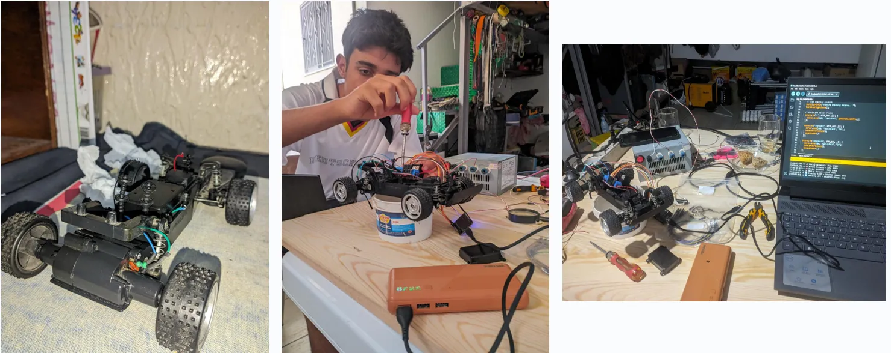
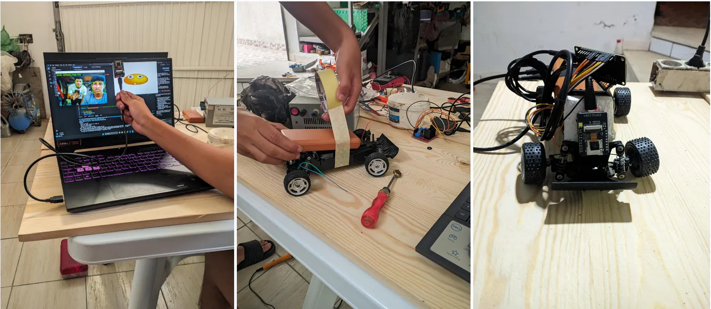
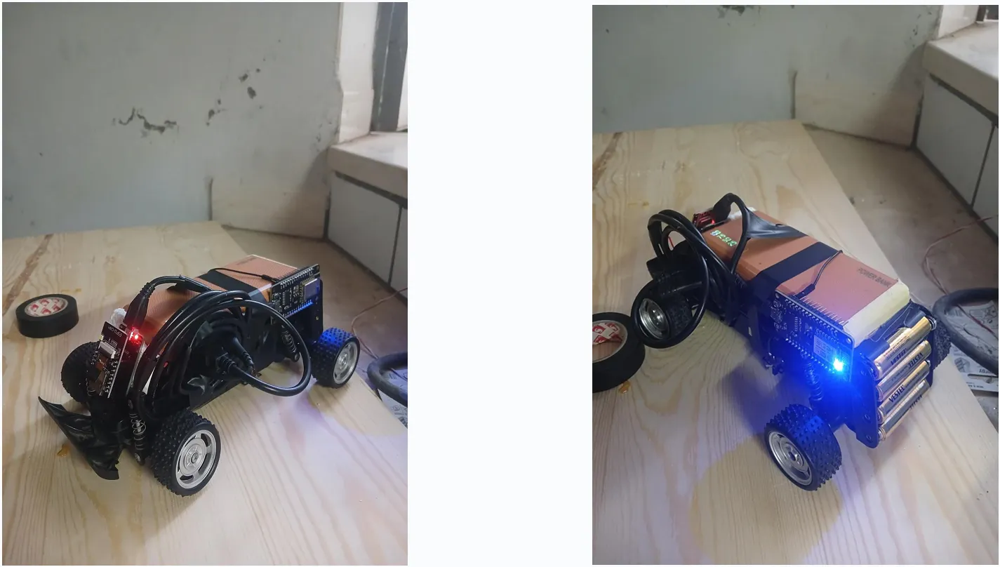
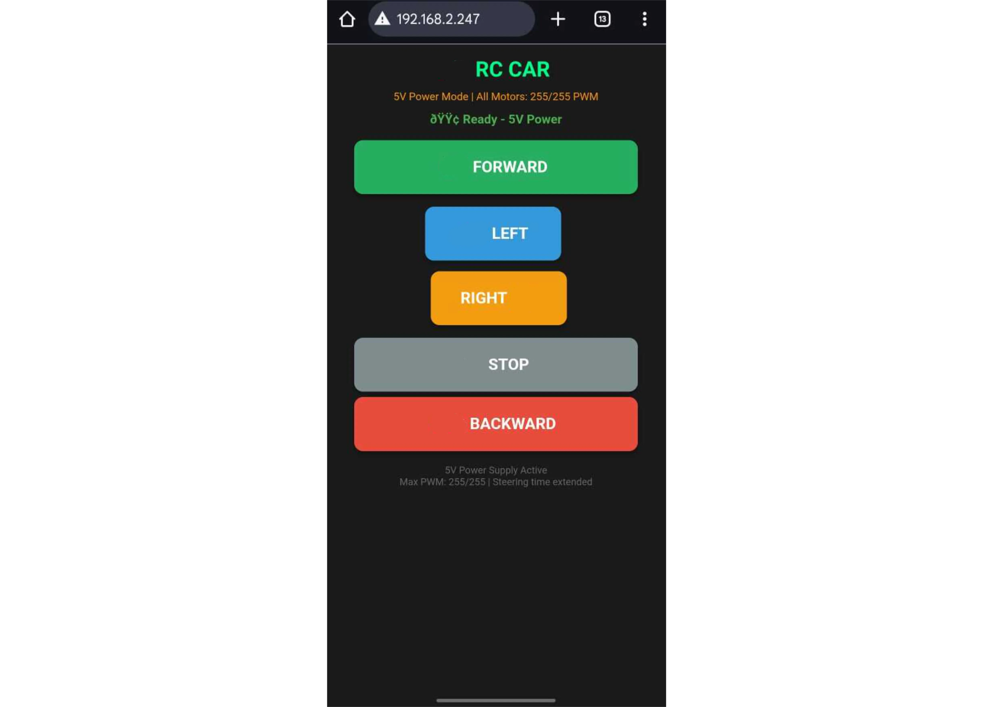

# Smart RC Car with AI Vision
---


>**A prototype for our car.**
---
A classic RC car transformed into a smart, web-controlled vehicle using IoT microcontrollers and computer vision. This project leverages an **ESP32-CAM** for live video streaming and an **ESP8266** for motor control, creating a platform that can be driven remotely via a web interface and enhanced with AI using Python's MediaPipe library.

---

## 🚀 Features

*   **Live Video Streaming:** ESP32-CAM streams real time video feed securely over HTTP to PYTHON script.
*   **Web Control Interface:**  Browser-based controller for driving the car remotely from any device on the same network.
*   **Dual-Microcontroller Architecture:** Separates the demanding task of video streaming (ESP32-CAM) from motor control (ESP8266) for stable performance.
*   **AI-Powered Vision:** The video stream is processed by a Python script using Google's MediaPipe for advanced tasks like:
    *   Facial Detection
    *   Current mood Recognition
    *   Facial expressions Detection


---

## 🛠️ Hardware Components

| Component | Quantity | Purpose |
| :--- | :--- | :--- |
| RC Car Chassis | 1 | Base vehicle platform. |
| ESP32-CAM Module | 1 | Primary controller for live video streaming. |
| ESP8266 (NodeMCU 1.0) | 1 | Dedicated controller for driving motors. |
| Motor Driver (L298N) | 1 | Interfaces the ESP8266 with the car's motors. |
| DC Motors | 2 | Movement of the car. |
|Power Bank | 2 | power for ESP32-CAM & ESP8266 Microcontrollers. |
| AA Batteries | 4 | Powers the 2 DC Motors. |
| Jumper Wires | 9 | Connections. |


> **Note:** Using two separate power sources helped us prevent noise from the motors from crashing the sensitive ESP32-CAM module.

---

## 📋 Software & Prerequisites

*   **Arduino IDE:** For programming the ESP32-CAM and ESP8266.
*   **Arduino Core for ESP32:** (for ESP32-CAM)
*   **Arduino Core for ESP8266:** (for ESP8266)
*   **Python 3.13:** For the computer vision backend.
*   **Python Libraries:**
    *   `opencv-python`
    *   `mediapipe`


---

## 🔧 Your guide for installation & Setup

### 1. Flashing the Microcontrollers

#### **ESP32-CAM (The "Eyes")**
1.  Select the "AI Thinker ESP32-CAM" board in the Arduino IDE.
2.  Install the necessary libraries for camera and WiFi.
3.  Upload the provided `esp32cam_stream.ino` sketch.
4.  **Don't forget to set your WiFi SSID and password in the code!**

>  **Tip:** 
> without the ESP32-CAM's USB board you may need an FTDI programmer to flash the ESP32-CAM.

#### **ESP8266 (The "Brain & Brawn")**
1.  Select your ESP8266 board (NodeMCU 1.0) in the Arduino IDE.
2.  Upload the provided `esp8266_webserver.ino` sketch.
3.  **Set the same WiFi credentials as the ESP32-CAM.**

After flashing, open the Serial Monitor for both devices to note their IP addresses.

### 2. Wiring

#### **ESP8266 to Motor Driver (L298N)**
| ESP8266 | L298N Motor Driver |
| :--- | :--- |
| D1 | IN1 |
| D2 | IN2 |
| D3| ENA |
| D4 | IN3 |
| D5| IN4 |
| D6 | ENB |

The motor outputs of the L298N are then connected to the RC car's motors.

#### **ESP32-CAM**
*   Connect the camera module to the ESP32-CAM board.
*   Provide a stable 5V power source.

### 3. Running the AI Script

1.  Navigate to the `emoji-reactor-main/` directory.
2.  Install the required Python packages:
    ```bash
    pip install -r mediapipe.txt
    ```
3.  Run the MediaPipe script, updating the `VIDEO_STREAM_URL` to your ESP32-CAM's HTTPS address:
    ```bash
    python emoji_reactor.py.py
    ```

---

## 🖥️ Usage

1.  **Power Up:** Turn on the power for both the ESP32-CAM and the ESP8266/motor system.
2.  **Access the Dashboard:** On any device connected to the same WiFi network, open a browser and go to `https://<ESP32-CAM_IP_ADDRESS>`. You will see the  control interface.
3.  **Drive the Car:** Use the on-screen buttons (Forward, Backward, Left, Right, Stop) to control the car.
4.  **Enable AI:** Run the Python MediaPipe script. The program will detect faces and dynamically output emoji reaction images based on the facial expression currently detected .

---

---

## 🖼️ Gallery

**The simplified Model**
> 
> *A minimal model for the full car.*

**Our work process**
> 
> 


*Some snippets from our hard work to get this project fully operational.*


**The Web Interface**
> 
> *The browser-based controller.*
---

## 🔮 Future Enhancements

*   **Obstacle Avoidance:** Integrate ultrasonic sensors with the ESP8266.
*   **Autonomous Navigation:** Implement a simple self-driving algorithm.
*   **Voice Control:** Add control via voice commands.
*   **Cloud Dashboard:** Use a service like Adafruit IO or MQTT for control over the internet.

---

## 🙏 Acknowledgments

*   Thanks to the Arduino and ESP32 communities for extensive documentation.
*   Google for the powerful MediaPipe library.
*   The open-source hardware ecosystem that makes projects like this possible.
